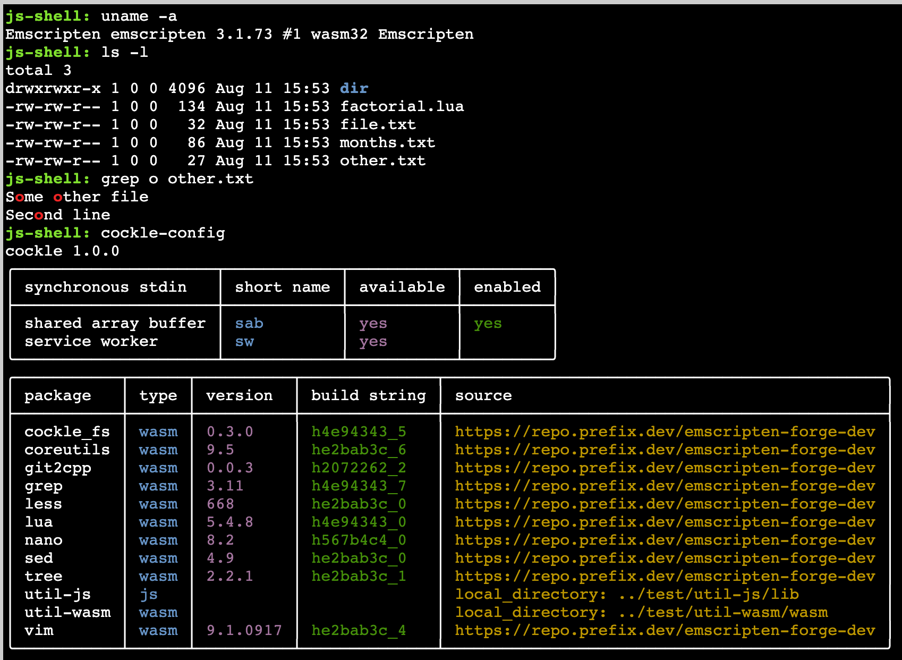

# cockle

In-browser bash-like shell implemented in a combination of TypeScript and WebAssembly.

Used in the [JupyterLite terminal extension](https://github.com/jupyterlite/terminal).

Try it out outside of JupyterLite on github pages at https://jupyterlite.github.io/cockle.

⚠️ This is an early-stage work in progress and should be considered experimental code. Anything and
everything could change at any time.

The commands used here are either built-in commands implemented in TypeScript, or WebAssembly
commands compiled into `.js` and `.wasm` files. The latter are built by
[Emscripten-forge](https://emscripten-forge.org/) and are added to a deployment during the build process.

[Emscripten-forge](https://emscripten-forge.org/) packages containing WebAssembly commands that are
currently supported and tested are as follows. Each package contains a single commmand with the same
name as the package unless otherwise specified:

- `coreutils`: multiple core commands including `cat`, `cp`, `echo`, `ls`, `mkdir`, `mv`, `rm`, `touch`, `uname`, and `wc`
- `grep`
- `less`
- `lua`
- `nano`
- `sed`
- `tree`
- `vim`

## Version compatibility

The filesystem used in `cockle` is built using a specific version of Emscripten, and for maximum
compatibility the WebAssembly commands used in `cockle` should be built using the same version of
Emscripten. WebAssembly commands built on Emscripten-forge are hosted on different
[prefix.dev](https://prefix.dev/channels) channels depending on the Emscripten version.

| `cockle` version    | `emscripten` version | `prefix.dev` channel   |
| ------------------- | -------------------- | ---------------------- |
| >= 1.4.0            | 4.0.9                | `emscripten-forge-4x`  |
| >= 0.1.14, <= 1.3.0 | 3.1.73               | `emscripten-forge-dev` |

## Build

```bash
micromamba env create -f environment-dev.yml
micromamba activate cockle
npm install
npm run build
npm run lint:check
```

You can use `conda`, `mamba` or `pixi` instead of `micromamba` here. A copy of
`micromamba` is installed into the `cockle` environment; this is needed to support the
`emscripten-wasm32` platform in the demo and tests.

## Demo

The `cockle` repository includes a demo so that you can easily try it out interactively in a web
browser. Once you have built `cockle`, build and run the demo using:

```bash
cd demo
npm install
npm run build
npm run serve
```

then open a browser at the specified URL:



The demo is served with cross-origin headers so that is supports synchronous `stdin` via both
SharedArrayBuffer and ServiceWorker. Use `cockle-config stdin` to check the current settings, and
`cockle-config stdin sw` to switch to using the ServiceWorker.

---

## Testing

The `test` directory contains unit tests and playwright integration tests which can be built and run
as follows:

```bash
cd test
npm install
npx playwright install --with-deps chromium
npm run build
npm run test
```

You can interactively run individual playwright tests using `npm run test:integration:ui`.
The testing framework serves its own CORS proxy using
[cors-anywhere](https://github.com/Rob--W/cors-anywhere) so that `git clone` of github repositories
can be tested without using an external CORS proxy that may be rate limited or otherwise restricted.

In addition, the `demo` directory contains separate visual tests that can be run in the same way.
Only Linux screenshots are stored within the repository.
